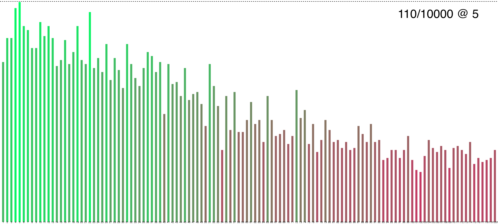
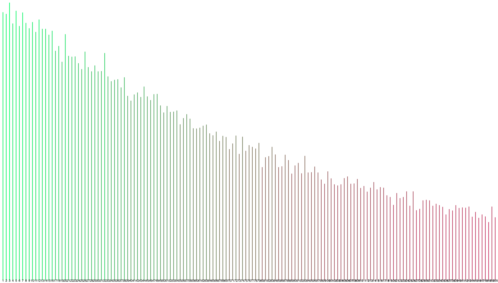

# Special Probability Distributions

<p>
The Probability Distributions Project is a TypeScript library that provides implementations of various 
probability distributions, including Bernoulli, Binomial, Poisson, Geometric, and Negative Binomial 
distributions. It offers methods to calculate the expected value, variance, and probability at specific values 
for each distribution. The project also includes examples of rendering distributions to generate visual charts.
</p>

## Table of Contents

- [Example Usage](#usage)
- [Render Example Graphs](#rendering-graphs)
- [Development](#development)
  - [Rendering Graphs](#rendering-graphs-1)
  - [Utils](#utils)

---

# Usage

```typescript
// index.ts

import { log } from './utils'
import {
  BinomialDistribution,
  BernoulliDistribution,
  PoissonDistribution,
  GeometricDistribution,
} from './distributions'

// Create instances of distributions
const bernoulli = new BernoulliDistribution(0.5)
const binomial = new BinomialDistribution(4, 1 / 3)
const poisson = new PoissonDistribution(5)
const geometric = new GeometricDistribution(0.5)

// Log information about the distributions
log(bernoulli)
log(binomial, 2)
log(poisson, 4)
log(geometric, 2)
```

<p>
Code: Creates instances of each distribution with specific parameters. 
 Finally, it uses the log function from <i>'utils.ts'</i> to log information about each distribution,
  including the calculated value, expected value, variance, 
  and probability at a specific value (if provided).
</p>

Run **`npm run log`** to see the output logged in the terminal.

---

## Rendering Graphs

The `render/[distribution_name].ts` files provide examples of rendering distributions. Each file demonstrates the rendering process for a specific distribution. Below are the available render examples:

It generates a chart showing the distribution of values obtained from multiple calculations of the geometric distribution.

### Commands to render example graphs:

- Geometric Distribution: **`npm run render:geo`**
- Negative Binomial Distribution: **`npm run render:negbin`**

### Example Rendered Graphs:

- Negative Binomial Distribution Chart (10_000 calculations for getting 3rd win on 10th try with 8%): 
- Geometric Distribution Chart (100_000 times trying until getting %1): 

---

# Development

## Rendering Graphs

First: Add a .ts file in the `render` directory to create a new example. Import the class of your distribution. Then:

1. Update the `totalTimes` variable to specify the number of calculations to perform.
2. Run the file using a TypeScript compiler or runtime environment. Or simply add it to the package.json file as a script and run it using `npm run render:[name]`.
3. The script will output the progress of the calculations as a percentage.
4. Once the calculations are complete, a chart image will be saved as `./generated/{distribution}_chart.png`, where `{distribution}` represents the specific distribution used.

## Utils

The `utils.ts` file provides two utility functions and a `Calc` class.

The `noop` function is an empty function that does nothing. It can be used as a placeholder or a no-operation function.

The `log` function is an asynchronous function that logs information about a given distribution. It takes the distribution instance (`dist`) and an optional value (`probAt`) as parameters. It calculates the value of the distribution, expected value, variance, and probability at the specified value (if provided) using the methods of the distribution class. The logged information includes the distribution's ID, calculated value, expected value, variance, and probability.

The `Calc` class provides mathematical calculation functions used by the distributions. It includes functions for factorial, power, combination, and the mathematical constant `e`.

Make sure to import the `log` function and `Calc` class from `utils.ts` when using them.
